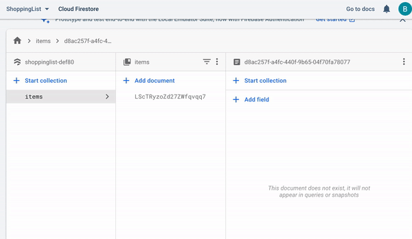

# React Native Shopping List App

> App for React Native crash course on YouTube

Extending crash course to fetch data from Google Firebase backend, and to run on Expo.

The app now talks to a Google Firebase firestore database to keep data inline with the in-app state. 
Adding, deleting and editing of items is available, updates locally and globally to the firebase db.

## Quick Start

``` bash
# Install dependencies
npm install

# Start
expo start

# Usage
scan the QR code with you device with Expo Go mobile app installed (or whatever method you prefer to run expo apps)
```

## Demo
Here's an iPhone screen recording showing the usage of the phone apps


And here's a recording of the firestore console showing the backend data being added/changed

